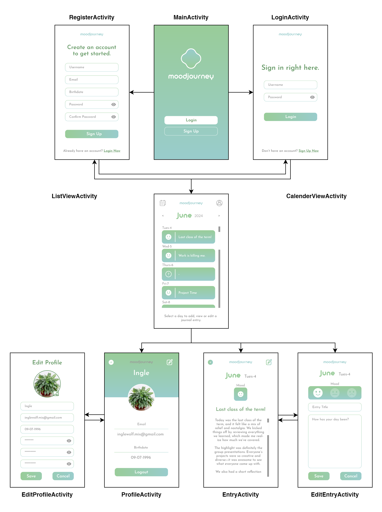
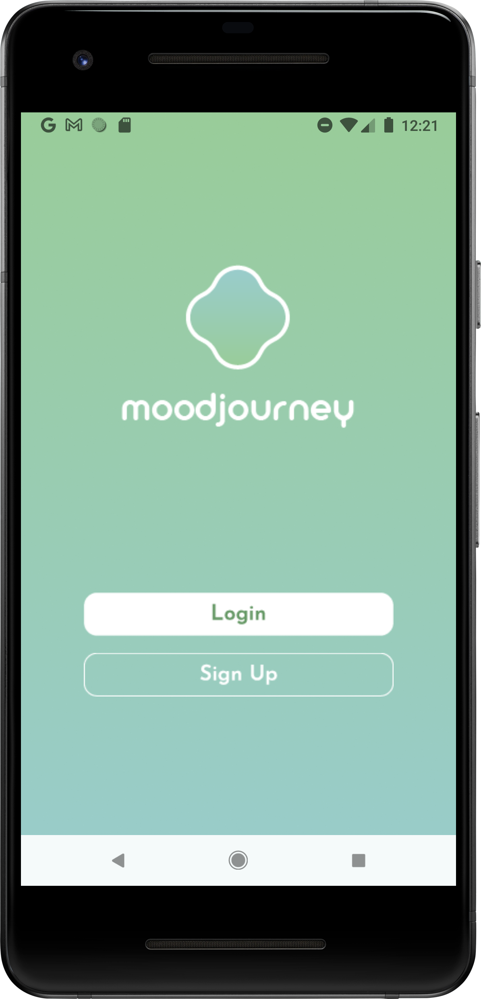
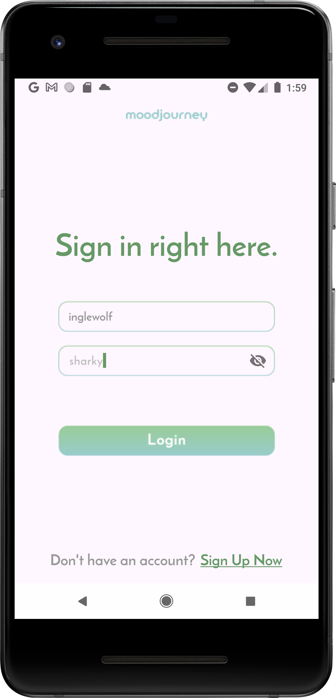
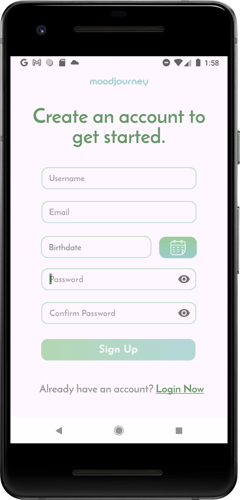
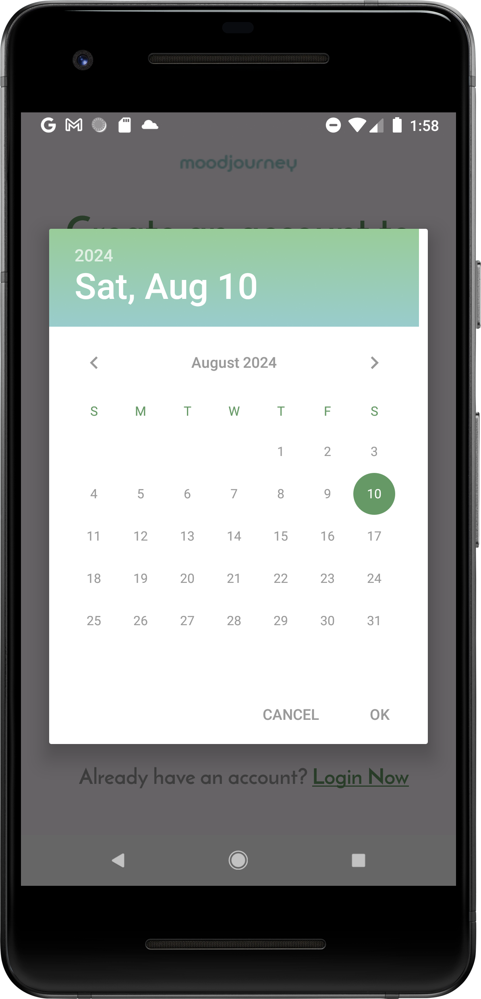
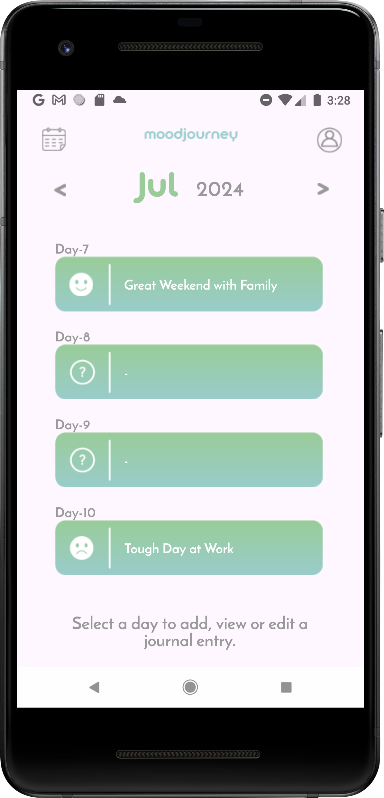
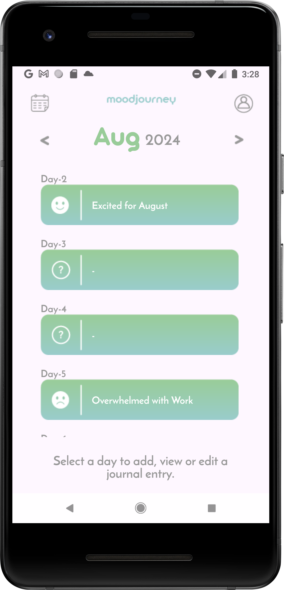
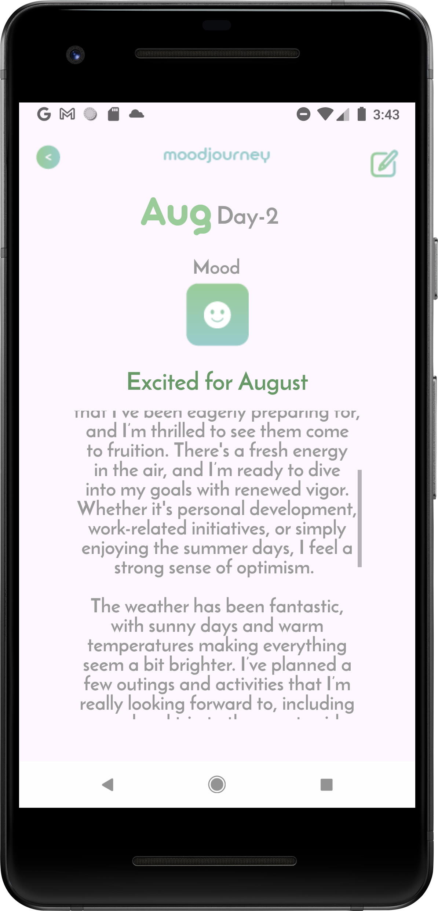
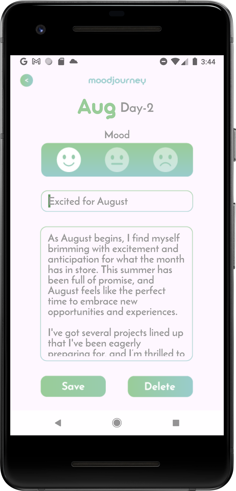
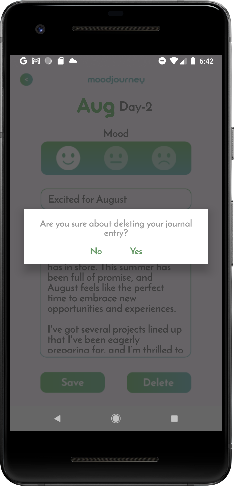

# MoodJourney
**MoodJourney** is a mobile application designed to help the user track their emotional  well-being. Much like managing a blog or keeping a diary, users can log their moods and pen down their thoughts but in a much more accessible, efficient &amp; private way.

**Daily Mood Tracker**: Users can select from 3 options to define their general mood of the 
day.  
 
**Reflective Journaling**: Together with picking a mood, users can log a journal entry 
where they may pen down their thoughts & feelings. They can navigate to any date to 
view what they had previously recorded. 
 
**List View**: Users will be able to scroll through a list view of a month’s days. On the days 
they have saved a journal entry, a mood icon to show their selected mood and the 
entry’s title will be displayed. The days that don’t have saved entries, will display with a 
question mark icon and an empty title. 
 
**Privacy**: Users will be required to create an account to access MoodJourney’s features. 
All of a user’s mood & journal logs will be stored safely in their accounts and is not 
accessible to public.

## Storyboard with UI Design

## Functionalities of Each Activity

| Activity & Function | Image    |
|:---------|:--------:|
|<h3>Main Activity</h3>**UI Elements**: • Login ImageButton: Navigates the user to LoginActivity. • Sign-Up ImageButton: Navigates the user to RegisterActivity.  **Functionality**: • When the app launches, it starts with MainActivity, presenting the user with two image buttons that takes them to the relevant activity.|    |
|<h3>LoginActivity</h3>**UI Elements**: •	Username Field: An EditText for the user to input their username. •	Password Field: An EditText with a password toggle, allowing users to hide or reveal their password. •	Login ImageButton: Initiates the login process. •	TextView Sign Up Link: Allows user to access RegisterActivity  **Functionality**: •	When the login button is clicked, the application checks if the username and password fields are empty. If either field is empty, a toast message prompts the user to fill in both fields. •	If both fields are filled, the entered credentials are sent to loginVolley.php. •	A query is used to check if the username exists in the database. If it does, the stored password is retrieved and compared to the one entered by the user. If no such user is found, a toast informs the user of such. •	If the passwords match, the user is successfully logged in and redirected to ListViewActivity. If not, a toast informs them that their username or password is invalid.|    |
|<h3>RegisterActivity</h3>**UI Elements**: • Username: An EditText to input their username. • Email: An EditText for the user to input their email address. • Password and Confirm Password: EditText fields with toggle buttons to show or hide the entered passwords. • Date Picker ImageButton: A button that launches a date picker for selecting the user's birthdate. • Birthdate TextView: The date selected from the picker is displayed here. • TextView Login Link: Allows user to access LoginActivity  **Functionality**: • The date picker allows users to select their birthdate from a calendar UI. The selected date is then displayed in the birthdate TextView. • When the sign-up button is clicked, the application first checks if all fields have been filled. Otherwise, it creates a toast to prompt the user to complete all fields. • The application then retrieves all user input and passes it to registerVolley.php for processing. • The back end checks if a user with the entered username or email already exists in the database. If such a user exists, the back end echoes a status message to the application, triggering a toast that displays “User already exists.” • If there is no such user, the back end runs an SQL query to insert the new user’s details into the database. After successful insertion, the user is prompted with a toast to log in with their new account and re-directed to LoginActivity.|   |
| <h3>ListViewActivity</h3>**UI Elements**: • ListView: Displays each day of the month as a list item. If a date has a saved entry, the list item shows the selected emoticon and the entry’s title. If no entry is saved, a question mark appears in the emoticon space, and the title field is empty. • Arrow ImageButtons: Allow navigation to the previous or next month. The month and year are displayed between these buttons. • Calendar ImageButton: Initially intended to switch to a calendar view, but currently non-functional. • Person ImageButton: Passes the user id and takes the user to ProfileActivity.  **Functionality**: • Upon loading, the application sends the current user’s id and the selected month to getEntriesListVolley.php. • The back-end program uses the provided details to fetch the entries of the selected month that were written by the selected user from the database. The data of those entries is sent to the application for further processing. • Back in the application, the number of days of the selected month is retrieved from the stored array. It then loops through each day of the month. If there is an entry saved on that day, the entry’s details are displayed in the list item. Otherwise, the list item displays the default. • The user can click into any of the list items. If the list item has an existing entry, the entry’s id will be passed on as an extra and the user will be taken to JournalEntryActivity. If there is no saved entry, the user will be taken to Add_Activity.|   |
|<h3>JournalEntryActivity</h3> **UI Elements**: • Month Name and Day TextViews: Displays the month and day of the journal entry • Emoticon ImageView: Displays the selected mood for the entry • Entry Title TextView: Displays the title of the journal entry • Entry Body TextView: Displays the body of the journal entry with a scroll bar for easier access • Back ImageButton: Returns the user to ListViewActivity • Edit ImageButton: Passes the entry’s id and takes the user to Edit_Activity to modify the current entry  **Functionality**: • Upon loading, the application retrieves the entry’s id from the previous activity and passes it to getSingleEntryVolley.php. • The entry’s id is used in an SQL query to retrieve all details of that entry. If the retrieval is successful, the data is sent in a response, back to the application. • If the retrieval fails, an error status message is sent back to the application which triggers a toast informing the user. The activity ends and the user is taken back to ListViewActivity. • The application then displays all the entry’s details into the appropriate TextView elements. • For the emoticon, the numeric, mood id, is compared. According to its number, the relevant image is set to the emoticon ImageView.   |    |
|<h3>EditActivity</h3> **UI Elements**:  • Month Name and Day TextViews: Displays the month and day of the journal entry • Emoticon Radio Buttons: Allows selection of the mood for the entry. The emoticon is pre-selected and highlighted in white, while unselected ones have reduced opacity. • Entry’s Title EditText: Input field for the entry's title, pre-loaded • Journal Entry’s Body EditText: Input field for the journal entry’s body text, with a scrollbar that appears if the text exceeds the visible area, pre-loaded • Save Image Button: Saves any changes done to the current entry • Delete ImageButton: Deletes the current entry  • Back ImageButton: Returns the user to the previous activity  **Functionality**: • Upon loading, the application retrieves the entry’s id from the previous activity and passes it to getSingleEntryVolley.php. • The entry’s id is used in an SQL query to retrieve all details of that entry. If the retrieval is successful, the data is sent in a response, back to the application. • If the retrieval fails, an error status message is sent back to the application which triggers a toast informing the user. The activity ends and the user is taken back to JournalEntryActivity. • The application then displays all the entry’s details into the appropriate EditText elements. • For the emoticon, the numeric, mood id, is compared. According to its number, the relevant radio button is set to checked. • When the user clicks the delete button, a confirmation dialog box appears. If the user clicks no, the box closes. If they click yes, a request is sent to deleteEntryVolley.php. • There, the server sends a query to get the user id of the selected entry. Then, a query is sent to delete the selected entry. The user’s id and the status message are sent back to the application. • Upon successful deletion, the current activity ends, and the user is taken back to ListViewActivity. • When the save button is clicked, all user input from the EditTexts and the value of the selected radio button is sent to saveExistingEntryVolley.php. • There, a query is sent to update the relevant details of the current entry in the database. • After updating successfully, the user is taken back to JournalEntryActivity to view the saved changes to their entry.   |   |
| Row 2    | Data C   |
| Row 2    | Data C   |
| Row 2    | Data C   |

